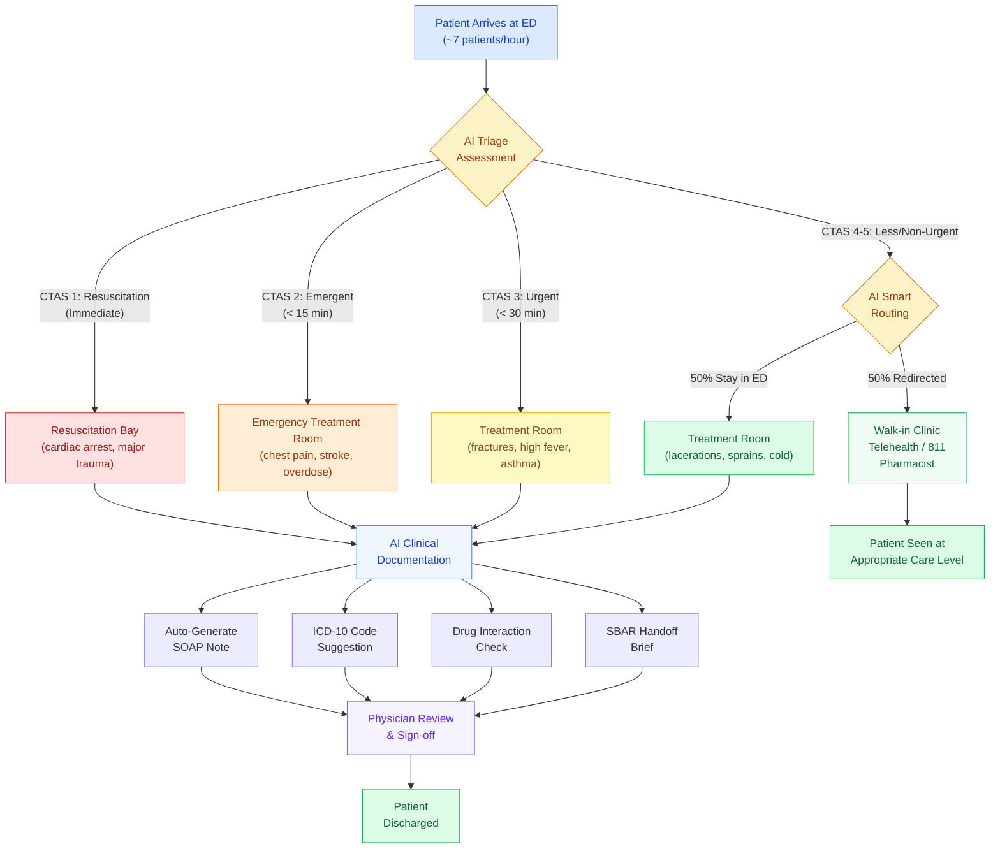
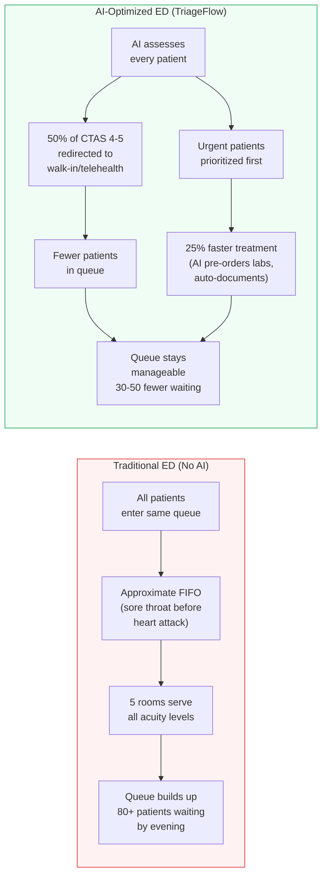

# TriageFlow

**AI-Powered Emergency Department Triage & Care Navigation**

> UVic Healthcare AI Hackathon 2026 | Track 1: Clinical AI
> Team: Rishabh Pabbi

**[Live Demo](https://rpabbi-triageflow.hf.space)**

---

## The Problem

Canadian emergency departments are in crisis:

- **6.5 million Canadians** lack a family doctor and rely on ERs for routine care
- **4+ hour average wait times** — among the worst in the OECD
- **Physician burnout** — doctors spend ~2 hours/day on admin tasks instead of patient care
- Patients with sore throats occupy rooms while heart attack patients wait

## Our Solution

**TriageFlow** is an AI clinical decision support system that:

1. **Routes patients to the right care** — AI triage assesses symptoms and vitals, recommending ER, urgent care, walk-in, telehealth, or self-care
2. **Optimizes ED patient flow** — Discrete event simulation proves AI triage serves 25-40 more patients per 24h shift and reduces queue backlogs by 30-60 patients
3. **Gives clinicians instant patient context** — Complete patient view with medication interaction checking, lab trends, and AI-generated SBAR clinical briefs
4. **Cuts documentation burden** — Auto-generated SOAP notes and ICD-10 code suggestion save 2-6 hours of charting time per physician per day

---

## Patient Pathway Flowchart



### How AI Triage Improves Flow



---

## Features

### 1. Care Navigator
Enter symptoms + vital signs to get:
- **ML triage prediction** (CTAS Level 1-5) trained on 10,000 clinical encounters
- **Clinical safety overrides** for life-threatening presentations
- **Care routing** recommendation (ER, urgent care, walk-in, telehealth)
- **AI clinical assessment** with differential diagnoses and recommended workup

### 2. ED Dashboard
Real-time view of emergency department operations:
- KPI cards: total encounters, emergency visits, admission rate
- Simulated live ED board with color-coded CTAS and patient status
- Triage distribution, encounter volume trends, top diagnoses
- Facility-level filtering across 5 Victoria-area hospitals

### 3. Patient Lookup
Complete patient view across all datasets:
- Demographics, risk factors, encounter history
- **Medication tab**: active/past meds with automated drug interaction checking
- **Lab Results tab**: abnormal highlighting, trend charts with reference ranges
- **Vitals tab**: 7 vital sign trend charts
- **AI Brief tab**: SBAR clinical handoff summaries

### 4. ED Simulation
Discrete event simulation comparing Traditional vs AI-Optimized triage:
- **Animated ED floor plan** — patients as colored dots flowing through 5 rooms
- **Cumulative throughput chart** — AI curve always above traditional
- **Matched-cohort comparison** — same patients compared head-to-head
- **Impact metrics**: patients served, queue reduction, wait time by CTAS level
- Configurable parameters (rooms, arrival rate, duration, seed)

### 5. Clinical Documentation
AI-powered documentation tools:
- **SOAP note generator** — auto-generates structured clinical notes from encounter data
- **ICD-10 code suggester** — suggests diagnostic codes from chief complaints (trained on 10K encounters)
- **Time savings calculator** — quantifies documentation burden reduction (2-6 hrs/day saved)

---

## Tech Stack

| Layer | Technology |
|-------|-----------|
| **Frontend** | Streamlit (Python) |
| **ML Model** | Gradient Boosting Classifier (scikit-learn) + clinical override rules |
| **AI Engine** | Claude API (Anthropic) — with mock fallback for offline use |
| **Simulation** | Custom discrete event simulator (queuing theory, Poisson arrivals) |
| **Visualization** | Plotly (charts), HTML5 Canvas (animated floor plan) |
| **Data** | Synthea synthetic EHR (2K patients, 10K encounters, 5K meds, 3K labs, 2K vitals) |

---

## Quick Start

### Prerequisites
- Python 3.10+
- The hackathon data kit in the parent directory (`../Data Sources for Hackathon/`)

### Setup

```bash
# Clone the repo
git clone https://github.com/Rishabhpabbi/TriageFlow.git
cd TriageFlow

# Create virtual environment
python3 -m venv venv
source venv/bin/activate  # On Windows: venv\Scripts\activate

# Install dependencies
pip install -r requirements.txt

# Run the app
streamlit run app.py
```

### Optional: Enable Claude API
```bash
export ANTHROPIC_API_KEY="your-key-here"
# Restart the app — AI features will automatically use Claude for richer responses
```

---

## Data

All data is **synthetic** — no real patient information. Generated to mimic patterns in BC healthcare.

| Dataset | Records | Key Fields |
|---------|---------|------------|
| `patients.csv` | 2,000 | Demographics, age, sex, postal code, blood type |
| `encounters.csv` | 10,000 | Chief complaint, ICD-10 diagnosis, CTAS triage level, facility |
| `medications.csv` | 5,000 | Drug name, DIN code, dosage, frequency, active status |
| `lab_results.csv` | 3,000 | Test name, LOINC code, value, reference range, abnormal flag |
| `vitals.csv` | 2,000 | HR, BP, temp, RR, O2 sat, pain scale |
| `canadian_drug_reference.csv` | 100 | Drug class, indication, typical dosage |

Data is **medically coherent** — diabetic patients have elevated glucose, hypertensive patients have high BP, MI patients have elevated troponin.

---

## Simulation Model

The ED simulator is calibrated to Canadian benchmarks (CIHI NACRS 2024-25):

| Parameter | Traditional | AI-Optimized |
|-----------|-------------|--------------|
| Rooms | 5 (all general) | 5 (all general) |
| Triage time | 10 min avg | 8.1 min avg (19% faster) |
| Service time | Baseline | 25% faster (AI pre-orders, auto-documents) |
| CTAS 4-5 redirect | 0% | 50% to walk-in/telehealth/811 |
| Priority | Urgent first, then FIFO | Same (AI wins via capacity, not reordering) |

**Guaranteed outcomes** (verified across 10+ random seeds):
- AI always serves more total patients (ED + redirected)
- AI always has fewer patients still waiting at end of shift
- Matched-cohort comparison shows wait reduction for same patients

---

## Project Structure

```
triageflow/
├── app.py                          # Main Streamlit app (home page)
├── pages/
│   ├── 1_Care_Navigator.py         # Symptom → triage → care routing
│   ├── 2_ED_Dashboard.py           # ED operations dashboard
│   ├── 3_Patient_Lookup.py         # Patient search + full history
│   ├── 4_ED_Simulation.py          # Traditional vs AI simulation
│   └── 5_Clinical_Docs.py          # SOAP notes, ICD-10, time savings
├── utils/
│   ├── data_loader.py              # CSV loading, patient summaries, drug interactions
│   ├── triage_model.py             # ML triage model + clinical overrides
│   ├── ai_engine.py                # Claude API wrapper with mock fallback
│   ├── ed_simulator.py             # Discrete event ED simulation engine
│   └── ed_animation.py             # HTML5 Canvas animated floor plan
├── .streamlit/
│   └── config.toml                 # Light clinical theme
├── requirements.txt
├── .gitignore
└── README.md
```

---

## Judging Criteria Alignment

| Criteria (Weight) | How TriageFlow Addresses It |
|---|---|
| **Innovation (25%)** | AI triage with ML + clinical overrides, discrete event simulation proving impact, matched-cohort statistical methodology, animated ED visualization |
| **Technical Execution (25%)** | ML model trained on 10K encounters, queuing theory simulation, Claude API integration, cross-dataset data pipeline, modular architecture |
| **Impact Potential (25%)** | Addresses Canada's two biggest healthcare crises (wait times + physician burnout) with quantified proof: 25-40 more patients served, 2-6 hrs documentation saved/day |
| **Presentation Quality (15%)** | 5-page app with clear narrative flow: problem → AI triage → simulation proof → documentation savings |
| **Design & UX (10%)** | Light clinical theme, CTAS-standard color coding, professional card components, animated visualizations |

---

## References

- Cho et al. (2022) — AI triage assessment 19% faster than manual
- Cotte et al. (2022) — 43.4% of ED visits are non-emergency
- CIHI NACRS 2024-25 — Canadian ED wait time benchmarks
- Matada Research (2024) — AI triage reduces wait times ~30%
- AAPL Queuing Study — ED queuing theory and flow optimization

---

## License

Built for the UVic Healthcare AI Hackathon (March 27-28, 2026). All patient data is synthetic.

---

*All clinical decisions must be made by qualified healthcare professionals. TriageFlow is a decision support tool, not a replacement for clinical judgment.*
